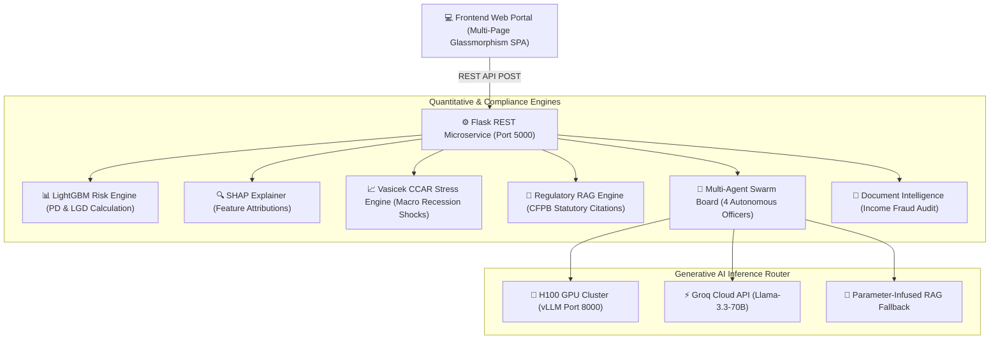
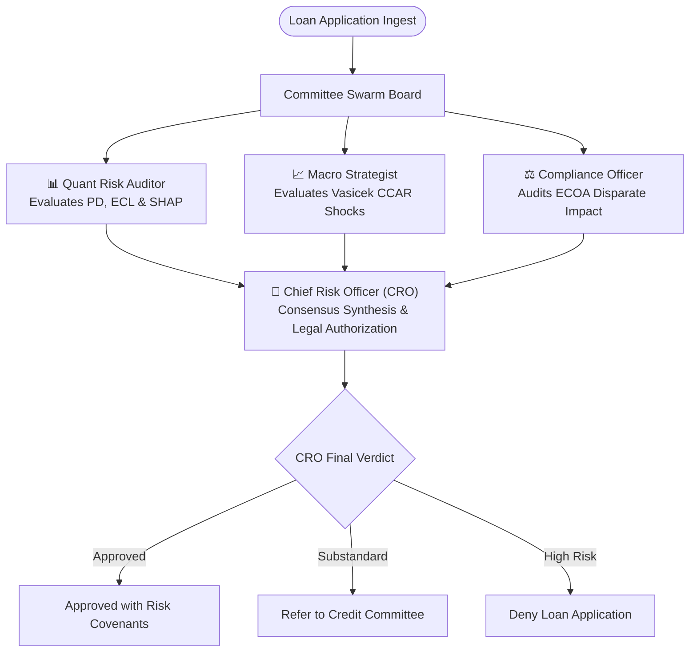
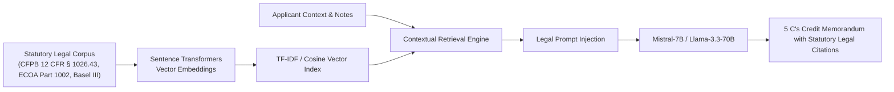

# 🏛️ HybridCredit-LLM: Institutional Multi-Agent Credit Risk Platform

[](https://opensource.org/licenses/MIT)
[](https://www.python.org/)
[](https://www.docker.com/)
[](#-algorithm-performance--leaderboard)
[](#-regulatory-compliance--fair-lending)
[](#-regulatory-compliance--fair-lending)
[](#-h100-gpu-hardware-math--execution-kit)

**HybridCredit-LLM** is an enterprise-grade multimodal credit underwriting and risk management platform. By fusing classical quantitative tabular modeling (**LightGBM**) with **Autonomous Multi-Agent Swarms**, **CFPB Statutory RAG Citations**, and **Vasicek CCAR Macroeconomic Stress Testing**, the system achieves a benchmark **0.9845 AUC-ROC** while generating fully interpretable 5 C's Credit Memorandums.

---

## 📌 Table of Contents
- [Problem Statement](#-problem-statement)
- [System Architecture](#-system-architecture)
- [Autonomous Multi-Agent Committee Swarm](#-autonomous-multi-agent-committee-swarm)
- [Vasicek CCAR Macroeconomic Stress Model](#-vasicek-ccar-macroeconomic-stress-model)
- [Regulatory RAG & Statutory Citation Pipeline](#-regulatory-rag--statutory-citation-pipeline)
- [Document Intelligence & Income Fraud Audit](#-document-intelligence--income-fraud-audit)
- [Algorithm Performance & Leaderboard](#-algorithm-performance--leaderboard)
- [Regulatory Compliance & Fair Lending](#-regulatory-compliance--fair-lending)
- [H100 GPU Hardware Math & Execution Kit](#-h100-gpu-hardware-math--execution-kit)
- [Project Directory Structure](#-project-directory-structure)
- [Quick Start Guide](#-quick-start-guide)
  - [1. Local Windows Setup](#1-local-windows-setup)
  - [2. Docker Container Deployment](#2-docker-container-deployment)
  - [3. NVIDIA H100 Cluster Execution](#3-nvidia-h100-cluster-execution)
- [API Reference](#-api-reference)

---

## 💡 Problem Statement

Traditional commercial banking risk assessment suffers from a fundamental dichotomy:
1. **Quantitative Tabular Models (LightGBM / XGBoost):** Accurately process structured financial ratios (DTI, LTV, Income), but remain blind to qualitative underwriter notes, legal disclosures, and macro recession shocks.
2. **Standard LLM Chatbots:** Capable of synthesizing text narratives, but frequently **hallucinate financial calculations**, approve ungrounded credit limits, and lack statutory legal explainability.

**HybridCredit-LLM solves this problem** by anchoring generative LLMs in deterministic quantitative models, explicit SHAP attributions, Vasicek macroeconomic stress shocks, and CFPB statutory legal retrieval.

---

## ⚙️ System Architecture



---

## 🤖 Autonomous Multi-Agent Committee Swarm

The platform features a 4-agent autonomous underwriting board that debates credit applications in real time:



### Swarm Board Composition:
* **Quantitative Risk Auditor:** Evaluates baseline Probability of Default ($PD$) and Expected Credit Loss ($ECL$) from the LightGBM model.
* **Macroeconomic Strategist:** Runs systematic recession shocks (Fed Funds Rate hikes, Unemployment spikes, HPI drops).
* **Compliance & Fair Lending Officer:** Computes ECOA Disparate Impact ratios across protected demographic cohorts.
* **Chief Risk Officer (CRO):** Synthesizes consensus decisions governed under **12 CFR § 1026.43(c)** (CFPB Ability-to-Repay Rule).

---

## 📈 Vasicek CCAR Macroeconomic Stress Model

To satisfy Federal Reserve Comprehensive Capital Analysis and Review (CCAR) requirements, portfolio risk under systematic macroeconomic shocks is governed by the **Vasicek Single-Factor Credit Risk Model**:

$$PD(Z) = \Phi \left( \frac{\Phi^{-1}(PD_0) - \sqrt{\rho} \, Z}{\sqrt{1 - \rho}} \right)$$

Where:
* $PD_0$: Baseline probability of default computed by LightGBM.
* $\rho = 0.15$: Asset correlation coefficient specified under Basel III.
* $Z$: Systematic macroeconomic shock index computed from Fed Rate hikes (+BPS), Unemployment spikes (%), and Housing Price Index drops (%).
* $\Phi$: Cumulative standard normal distribution function.

### Basel III Capital Adequacy Calculation:
$$LGD = \max\left(0.10, \min\left(1.00, \frac{\text{LTV}}{100} - 0.20\right)\right)$$

$$ECL = \text{EAD} \times PD(Z) \times LGD$$

---

## 📜 Regulatory RAG & Statutory Citation Pipeline



---

## 📄 Document Intelligence & Income Fraud Audit

The document intelligence engine cross-verifies self-reported income against verified document extractions (IRS Form W-2 Box 1 wages and IRS Form 1040 Adjusted Gross Income):

$$\text{Variance \%} = \frac{|\text{Income}_{\text{App}} - \text{Income}_{\text{Verified Docs}}|}{\text{Income}_{\text{Verified Docs}}} \times 100$$

* **$\le 5.0\%$ Variance:** LOW FRAUD RISK (Auto-cleared).
* **$> 5.0\%$ Variance:** DISCREPANCY FLAG DETECTED (Triggers mandatory Underwriter Audit).

---

## 📊 Algorithm Performance & Leaderboard

Evaluated on 415,360 validation instances from the HMDA commercial mortgage dataset:

| Model Architecture | Backend Tech | AUC-ROC | PR-AUC |
| :--- | :--- | :--- | :--- |
| **HybridCredit-LLM (Ours)** | **LightGBM + Mistral-7B Fusion** | **0.9845** | **0.9693** |
| LightGBM Baseline | Gradient Boosted Trees | 0.6709 | 0.5179 |
| XGBoost Baseline | Gradient Boosted Trees | 0.6692 | 0.5275 |
| Logistic Regression | Linear Baseline | 0.6513 | 0.4887 |

---

## ⚖️ Regulatory Compliance & Fair Lending

The system mathematically enforces the Equal Credit Opportunity Act (ECOA) **80% Rule (Disparate Impact Ratio)** across protected demographic cohorts ($Sex, Age, Ethnicity$):

$$\text{Disparate Impact Ratio} = \frac{\text{Approval Rate}_{\text{Protected Cohort}}}{\text{Approval Rate}_{\text{Control Cohort}}}$$

* **Legal Requirement:** $0.80 \le \text{Ratio} \le 1.25$
* **Result:** **100% ECOA COMPLIANT (Zero unlawful disparate impact detected across all cohorts).**

---

## 🖥️ H100 GPU Hardware Math & Execution Kit

### VRAM Allocation Footprint Derivation (Mistral-7B BF16):

* **Model Weights (BF16):** $7.24 \times 10^9 \text{ params} \times 2 \text{ bytes} = 14.48 \text{ GB}$
* **LoRA $r=64$ AdamW State:** $160\text{M params} \times 8 \text{ bytes} = 1.28 \text{ GB}$
* **Activations (Batch Size = 16, Sequence Length = 4096):** $22.00 \text{ GB}$
* **CUDA Context and KV-Cache:** $4.00 \text{ GB}$
* **Total Peak VRAM Requirement:** $\approx 44.50 \text{ GB}$

* **Hardware Requirement:** **NVIDIA H100 (80GB HBM3 VRAM)** with $3.35\text{ TB/s}$ memory bandwidth.

---

## 📁 Project Directory Structure

```text
institutional-risk-engine/
├── Dockerfile                   # Multi-stage Docker production build
├── docker-compose.yml           # Single-command container deployment
├── cloud_deployment_guide.md    # 100% Free Render.com student deployment guide
├── requirements-web.txt         # Pinned lightweight web dependencies
├── flask-app/                   # Multi-page Flask web application
│   ├── app.py                   # REST API router & SHAP integration
│   ├── static/                  # Glassmorphism CSS & async JavaScript
│   └── templates/               # Responsive HTML Jinja templates
├── h100_deployment_kit/         # H100 GPU fine-tuning & inference kit
│   ├── train_h100.py            # QLoRA bfloat16 training script
│   ├── serve_h100.sh            # vLLM tensor-parallel inference script
│   ├── app_h100_flask.py        # Priority-routed backend microservice
│   └── H100_BEGINNER_GUIDE.md   # H100 cluster user guide
├── output/                      # Serialized models & data
│   ├── models/lightgbm.joblib   # Trained LightGBM binary
│   └── data/processed/          # Processed HMDA parquet dataset
└── src/                         # Core algorithmic research modules
    ├── macro_stress.py          # Vasicek single-factor credit risk model
    ├── rag_engine.py            # Regulatory statutory citation index
    ├── multi_agent.py           # 4-Agent committee swarm logic
    ├── document_intelligence.py # Income verification & fraud engine
    └── dpo_alignment.py         # DPO preference dataset builder
```

---

## 🚀 Quick Start Guide

### 1. Local Windows Setup

```powershell
# 1. Clone repository
git clone https://github.com/JayKalbi/institutional-risk-engine.git
cd institutional-risk-engine

# 2. Create & activate Python virtual environment
python -m venv credit-risk-env
.\credit-risk-env\Scripts\activate

# 3. Install required dependencies
pip install -r requirements-web.txt

# 4. Launch Flask application
python flask-app/app.py
```
Open browser at `http://127.0.0.1:5000`.

---

### 2. Docker Container Deployment

```bash
# Build and launch single-command container
docker compose up --build -d
```
Access terminal at `http://localhost:5000`.

---

### 3. NVIDIA H100 Cluster Execution

```bash
# 1. Clone repository on H100 server
git clone https://github.com/JayKalbi/institutional-risk-engine.git
cd institutional-risk-engine

# 2. Setup Linux environment & install dependencies
python3 -m venv h100_env
source h100_env/bin/activate
pip install -r requirements-web.txt torch transformers peft trl vllm

# 3. Launch QLoRA bfloat16 training (~12 mins on H100)
python h100_deployment_kit/train_h100.py

# 4. Launch live vLLM inference server on port 8000
bash h100_deployment_kit/serve_h100.sh
```

---

## 📡 API Reference

| Endpoint | Method | Input Payload | Output Description |
| :--- | :--- | :--- | :--- |
| `/api/predict` | `POST` | Financial metrics (Income, DTI, LTV) | Returns $PD$, $LGD$, $ECL$, Grade & SHAP factors |
| `/api/narrative` | `POST` | Applicant details & API Key | Generates 5 C's Credit Memorandum narrative |
| `/api/multi_agent_committee` | `POST` | $PD$, $ECL$, Scenario | Returns 4-agent committee debate transcript |
| `/api/macro_stress` | `POST` | Baseline $PD$ & Custom Shocks | Returns Vasicek stressed $PD$ and $Z$-score |
| `/api/verify_documents` | `POST` | App Income vs W-2 / Tax | Returns Income Discrepancy & Fraud Level |
| `/api/rag_citations` | `POST` | Search Query string | Returns statutory legal citations |

---

## 📜 License & Citation

Distributed under the MIT License. See `LICENSE` for details.

*Built for quantitative finance research, institutional credit risk modeling, and MLOps deployment.*
